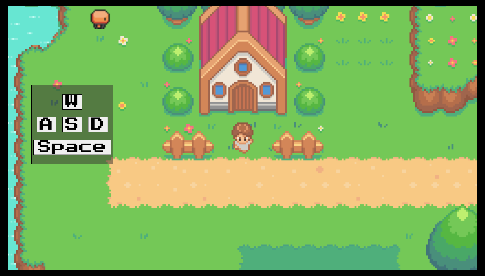
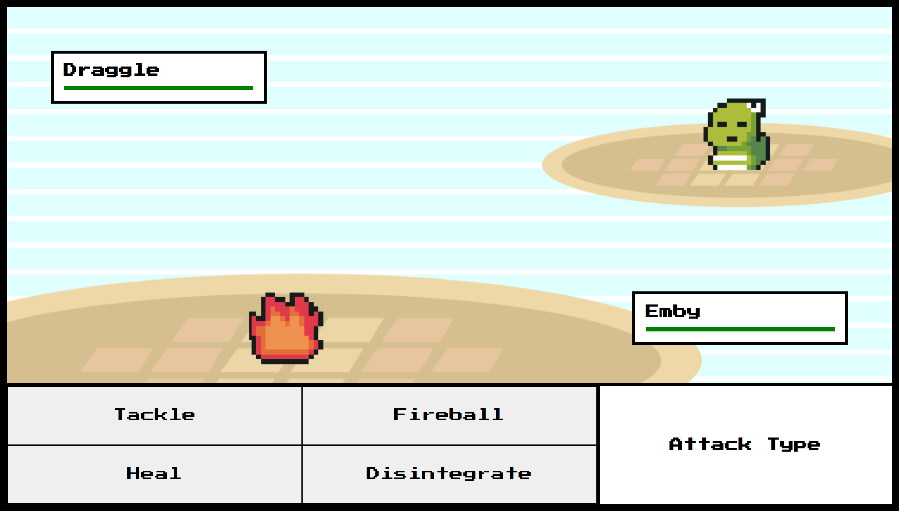

# Basic Pokemon Clone

## Description

Basic Pokemon Clone is an in browser game built with basic JavaScript and HTML in order to run a game. It allows the user to walk around a world map, stop moving based on item boundaries, enter combat by walking within tall grass, play and change music based on the situation, and talk to npc's and cycle through dialogue. The reason for building this game was to get a basic grasp of game development concepts before moving on to Unity and C# programming.

While building this project I learned to:

- Edit and style the `<canvas>` element using JS
- Build custom classes with reusable methods
- Cycle through the different frames of a sprite
- Build a map with boundaries, characters, backgrounds, foregrounds, and battle zones using [Tiled Map Editor](https://www.mapeditor.org/)
- Find free assets from [itch.io](https://itch.io/)

### Built With

## Table of Contents

- [Usage](#usage)
- [Installation](#installation)
- [Contributing](#contributing)
- [License](#license)
- [Contact](#contact)

## Usage

Navigate to [mateo-wallace.github.io/MP3-Basic-Pokemon-Clone/](https://mateo-wallace.github.io/MP3-Basic-Pokemon-Clone/) in order to see the site. You will be presented with the your player standing outside of their house. It will look something like this:

- To **move** either type `w, a, s, d` or click on the ones on screen. The on screen version was added to allow for mobile functionality.

- To **interact with in an npc** walk up to them until you can no longer move then use `space`. This will initiate their dialogue. Your movement will be haulted while dialogue in initiated. In order to continue through npc dialogue simply continue to use `space` until they stop talking.

- To **enter combat** enter a dark green patch of grass, like this one:

  

  You will have a 1.5% chance of entering combat while walking on these tiles. Once you have entered combat your screen will shift to a battle scene like this one:

  

  From within the battle scene simply select the type of attack you would like to use.

  - Tackle does 10% damage
  - Fireball does 25% damage
  - Heal recovers the players health by 10%
  - Disintegrate does 100% damage, basically an instakill

  After every action text will appear on screen describing what happened. Click on the text box in order to cycle through the text. Once combat is completed you will be brought back to the overworld.

(<a href="#readme-top">back to top</a>)

## Installation

If you would like to download the project locally:

1. Fork the Project
1. Clone the Repo to your machine
1. To run the game right click `index.html` and select `Open In Default Browser`

(<a href="#readme-top">back to top</a>)

## Contributing

If you have a suggestion that would make the repo better, please fork the repo and create a pull request. You can also simply open an issue with the tag "enhancement". Don't forget to give the project a star! Thanks again!

1. Fork the Project
1. Create your Feature Branch (`git checkout -b feature/AmazingFeature`)
1. Commit your Changes (`git commit -m 'Add some AmazingFeature'`)
1. Push to the Branch (`git push origin feature/AmazingFeature`)
1. Open a Pull Request

If all of this is new to you take a look at the [GitHub Docs](https://docs.github.com/en/get-started/quickstart/fork-a-repo).

(<a href="#readme-top">back to top</a>)

## License

Distributed under the MIT License. See [LICENSE](./LICENSE) for more information.

(<a href="#readme-top">back to top</a>)

## Contact

Mateo Wallace - [GitHub](https://github.com/Mateo-Wallace) - [Email](mailto:mateo.t.wallace@gmail.com) - [LinkedIn](https://www.linkedin.com/in/mateo-wallace/)

Project Link: [MP3-Basic-Pokemon-Clone](https://github.com/Mateo-Wallace/MP3-Basic-Pokemon-Clone)

(<a href="#readme-top">back to top</a>)

## Acknowledgments

I am appreciative for the source code, ideas, and inspiration that all of these repos and creators have provided to this project. If you see anything within my code that you recognize as yours and don't see yourself listed here please feel free to open an issue and I will add you!

- [Chris Courses - Pokemon JavaScript Game Tutorial with HTML Canvas](https://www.youtube.com/watch?v=yP5DKzriqXA)
- [chriscourses - pokemon-style-game](https://github.com/chriscourses/pokemon-style-game)

(<a href="#readme-top">back to top</a>)

